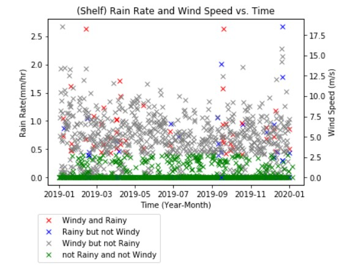
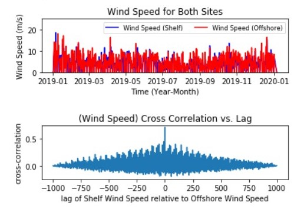

__Link to Jupyter Notebook on GitHub:
https://github.com/jakep3/Project-2-/blob/master/Project_2_Philpott_Meteorology.ipynb__

Jake Philpott

BME 450

2/20/2020

                                   Project 2: Meteorology Instrument Package Assignment

__PROBLEM STATEMENT__ 

The purpose of this project was to become familiar with the Bulk Meteorology Instrument Package and how to use the data it presents. The two instrument sites of interest for the project were the Oregon Shelf Surface Mooring (Shelf) and the Oregon Offshore Surface Mooring (Offshore), both of which have data available on the Ocean Observatory Initiative website (OOI) [1]. Using one years’ worth of available data, the following tasks were performed and questions answered:

1.	For each site, plot wind speed (m/s) and rain rate (mm/hr) for these time windows:
    -	When it is windy and rainy,
    -	When it is rainy but not windy,
    -	When it is windy but not rainy,
    -	When it is not windy and not rainy.

2.	Plot the cross-correlation function between wind speeds at both sites.
    - What is the highest correlation?
    - What is the time lag?

3.	Plot the cross-correlation function between rain rates at both sites.
    - What is the highest correlation?
    - What is the time lag?

4.	Is there any relationship between the time lag of wind speed and rain rate?

5.	Calculate and plot the monthly average of the wind speed and rain rate for each site.
    - What pattern do you see? Explain.
    - Which month had the highest rain rate? Which had the lowest?
    - Which month had the highest wind speed? Which had the lowest?

__BACKGROUND__

The Bulk Meteorology Instrument Package measures a variety of parameters that characterize weather conditions above the sea surface, including wind speed at the surface and rain rate. The Ocean Observatories Initiative has many research devices that can be explored and whose data can be downloaded and examined on their website. The instruments of interest for this project are the Bulk Meteorology Instrument Packages for the following:
  - Oregon Shelf Surface Mooring
  - Oregon Offshore Surface Mooring

__SOLUTION__

The solution to complete the tasks and answer the questions began by visiting the OOI website and obtaining one year of data for each instrument. The data was extracted through M2M and is accessible directly though Jupyter Notebook. In Jupyter Notebook, all the data was able to be analyzed and used to obtain the results. Results largely came from evaluating the data and plots, and allowed for the trends to be viewed and explained. Please refer to the link at the beginning of the paper to view the Jupyter Notebook if interested in the specific code that allowed for data extraction and the derivation of the results. 

__RESULTS__

(The data used uses the time frame: January-01-2019 to January-01-2020). 

1.	The rain rates and wind speeds with respect to time were able to be compiled into arrays and plotted. The data points plotted identify the following conditions; windy and rainy, rainy but not windy, windy but not rainy, and not rainy and not windy. See Figure 1 for Shelf results and see Figure 2 for Offshore results.

__Figure 1:__ Wind speed and rain rate for one year for the Shelf site.

__Figure 2:__ Wind speed and rain rate for one year for the Offshore site.

2.	The plot of the cross-correlation function between wind speeds at both sites can be seen below in Figure 3. The highest correlation is 0.721 and the time lag is 0. These values were able to be found using Jupyter Notebook functions.  
 
 

__Figure 3:__ The top plot is wind speeds vs time. The lower plot is cross-correlation vs lag (sec).

3.	The plot of the cross-correlation function between rain rates at both sites can be seen below in Figure 4. The highest correlation is 0.582 and the time lag is 0. These values were able to be found using Jupyter Notebook functions.

__Figure 4:__ The top plot is rain rates vs time. The lower plot is cross-correlation vs lag (sec).

4. The wind speed cross correlation vs lag graph shows a normal distribution, with the maximum correlation at time lag zero. The rain rate cross correlation vs lag graph shows three normal distributions; one centered between -1000 and -750, one centered between -250 and 250, and the third centered between 750 and 1000. Also, the maximum correlation is at time lag zero. For both wind speed and rain rate for the two site, their maximum cross-correlations occur at time lag = 0. However, I do not think this is a strong relationship and I do not see any other relationships between the time lag of wind speed and rain rate. 

5.	Figure 5 and 6 will show the plots for the monthly averages of wind speed and rain rate for the Shelf site and Offshore site respectively. The pattern that is apparent for both of the sites is that wind speed and rain rate increase and decrease together. This means that when wind speed increases or decreases, the rain rate increases or decreases. This appears to be the trend; however they do not move on the same scale. The pattern is apparent on the figures to follow.
For both sites, the highest rain rates and wind speed rates occurred in during the winter months and the lowest rates occurred during the late summer and early fall months. More specifically, for the Shelf site; the highest wind speed and rain rate occurred in January and February respectively; and the lowest wind speed and rain rate were both in August. For the Offshore site; the highest wind speed and rain rate occurred January and December respectively; and the lowest wind speed and rain rate were in September and August respectively. A summary of the months and associated values can be seen in Table 1 for both Shelf and Offshore.

__Figure 5:__ The monthly average values for wind speed and rain rate at the Shelf site.

__Figure 6:__ The monthly average values for wind speed and rain rate at the Offshore site.

 

__Table 1:__ The highest and lowest values, with associated months, for wind speed and rain rate for the Shelf site and Offshore site. 

__CONCLUSIONS__

The purpose of this project was to become familiar with the Bulk Meteorology Instrument Package and how to use the data it presents in order to discover trends regarding wind speed and rain rate for the Oregon Shelf Surface Mooring and the Oregon Offshore Surface Mooring sites. The data available on the OOI website was evaluated using the effective tool, Jupyter Notebook. To recap the results from the tasks and questions: the wind speed and rain rates were plotted for various circumstances, the highest correlation for wind speed at both sites was at the time lag = 0, and the highest correlation for rain rate at both sites was at time lag = 0. There does not appear to be any relation between the time lag of wind speed and the time lag of rain rate. When plotting the monthly averages, it was apparent that for both sites, the wind speed and rain rate values increase and decrease with each other. This was true for all months, and it appears that rain rate and wind speed both have their highest values in the winter and their lowest values during the early fall. From the results, it is possible to conclude that rain rate and wind speed have a direct relationship where if one increases, the other increases, and vis-versa. This is an important relation that may be useful for predicting the weather and understanding storms.  

__REFERENCES__

[1] 	"Ocean Observatories Initiative," [Online]. Available: https://oceanobservatories.org/. [Accessed January 29 2020].

